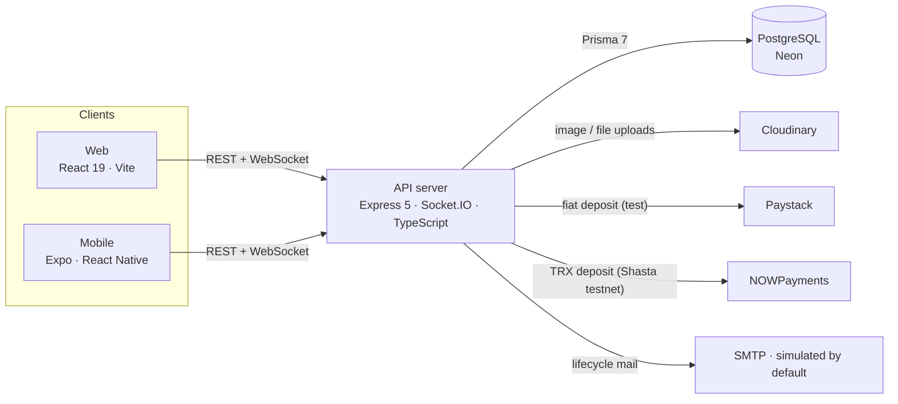
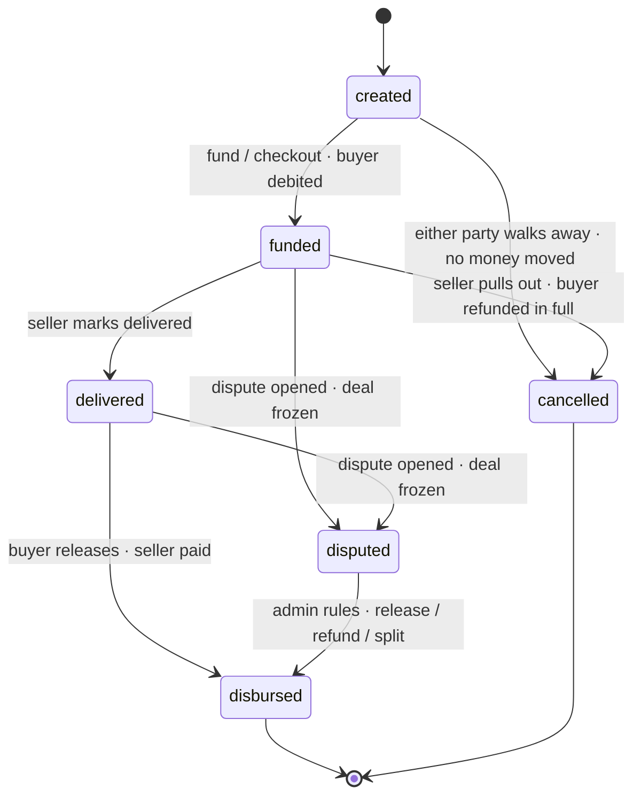

<div align="center">

# VeriTrust

### A Trust‑as‑a‑Service P2P marketplace with a built‑in escrow engine — web, mobile, and API.

Buyers pay into escrow, sellers ship, and money is only released when the buyer confirms delivery. When a deal goes wrong, a human admin arbitrates and the funds move to match the ruling.

[-b30000.svg)](LICENSE)


</div>

---

## Table of contents

- [What is VeriTrust?](#what-is-veritrust)
- [Academic context & scope disclaimer](#academic-context--scope-disclaimer)
- [Screenshots](#screenshots)
- [Features](#features)
- [Tech stack](#tech-stack)
- [System architecture](#system-architecture)
- [The escrow lifecycle](#the-escrow-lifecycle)
- [Repository layout](#repository-layout)
- [Getting started](#getting-started)
- [Environment configuration](#environment-configuration)
- [Deployment](#deployment)
- [Documentation index](#documentation-index)
- [Project status & roadmap](#project-status--roadmap)
- [Contributing](#contributing)
- [Security](#security)
- [Team](#team)
- [License](#license)

---

## What is VeriTrust?

Peer‑to‑peer commerce runs on trust that strangers rarely have. The buyer fears paying for nothing; the seller fears shipping for free. **VeriTrust removes that standoff by holding the money in escrow** between them:

1. A buyer funds a deal — the amount is locked, not sent to the seller.
2. The seller delivers and marks the deal shipped.
3. The buyer confirms receipt, and only then is the seller paid.
4. If either side disputes, the deal **freezes** and a platform admin rules on where the money goes — release to the seller, refund to the buyer, or a split.

VeriTrust ships this as a small ecosystem rather than a single app:

- a **marketplace** where verified sellers list goods and buyers check out into an escrow‑backed order, and
- a **standalone escrow engine** for off‑marketplace deals between any two accounts, joinable by a share code or QR — the "escrow as a service" idea, usable without a listing at all.

Both run over one **API server** with a real state machine, a double‑checked money ledger, realtime chat, KYC, and a full admin console; and both are consumed by a **React web client** and an **Expo (React Native) mobile app** that share the same backend.

---

## Academic context & scope disclaimer

VeriTrust is the **Group 2 mini‑project** for the BSc Computer Science programme at the **Kwame Nkrumah University of Science and Technology (KNUST)**. It is built to the [Group 2 project proposal](Group_2_P2P_Marketplace_Escrow_Project_Proposal%20%282%29.pdf) and is intended as a working, demonstrable system — not a production financial service.

> ### ⚠️ This is a demonstration system — no real money moves on the fiat rail.
>
> - **Fiat / mobile‑money (GHS) payments are simulated.** Checkout, deposits and withdrawals move balances **atomically inside the database** so the ledger is always correct, but **no real charge is ever made** and no processor settles funds. A test‑mode Paystack integration exists behind an env flag for demonstrating a real card/momo *flow*, still against test money.
> - **The crypto rail (TRX on the TRON Shasta testnet, via NOWPayments sandbox) is the only rail wired to move "real" value**, and it is **testnet only** — never mainnet.
> - **Email/SMS are simulated to the server console** by default (an SMTP driver can be switched on).
> - Because no real value settles, VeriTrust deliberately does **not** implement the licensing, AML/KYC depth, or custody controls a live money‑transmitting service in Ghana would legally require. Testnet‑only crypto is a conscious compliance boundary, not an oversight.

---

## Screenshots

> The live **web client**, captured against seeded demo data. Amounts shown are simulated GH₵.

<table>
  <tr>
    <td colspan="2"></td>
  </tr>
  <tr>
    <td width="50%"><br/><sub><b>Marketplace</b> — search, filter and browse listings</sub></td>
    <td width="50%"><br/><sub><b>Listing detail</b> — buy into escrow, message the seller</sub></td>
  </tr>
  <tr>
    <td width="50%"><br/><sub><b>Authentication</b> — sign in by email or username</sub></td>
    <td width="50%" align="center"><br/><sub><b>Responsive</b> — the web client at phone width</sub></td>
  </tr>
</table>

> The [mobile app](mobile/) (Expo / React Native) mirrors these flows natively on iOS and Android.

---

## Features

<table>
<tr><td width="50%" valign="top">

**🛒 Marketplace**
- URL‑driven search, category, condition, price and sort filters
- Listing detail with seller card, reviews and average rating
- Save listings, block vendors (with a reason), message sellers
- Real Cloudinary image uploads on listings
- Paid listing **promotions** (7/14/30‑day spotlights)

**🔒 Escrow engine (the core)**
- Single `transition()` gateway: state + actor guards, money moves in the **same DB transaction**, every change appends an immutable event
- 6‑state machine: `created → funded → delivered → disbursed | disputed`, plus `cancelled`
- Fee math in integer pesewas, fee locked at creation
- **Standalone deals** joinable by share code + QR

**💬 Realtime messaging**
- One 1:1 thread per user pair over **Socket.IO**
- Text, file attachments, and live deal **system notices**
- Postgres is the source of truth — history survives reloads and offline catch‑up

</td><td width="50%" valign="top">

**⚖️ Disputes & arbitration**
- Either party freezes a deal; the pair is locked from new deals while open
- Admin case view merges chat + state changes into one evidence chronology
- Ruling console: a single dial over the buyer's refund with a live split preview
- An admin ruling is **final** — the only way a dispute ends

**👛 Wallet & payouts**
- Cleared / pending‑clearance / escrow‑locked balances
- Atomic guarded debits (no negative balances, no double‑spend)
- Signed‑amount transaction history with deal links
- Auditable **withdrawal** requests reviewed by an admin

**🪪 KYC & roles**
- Buyer → seller upgrade via a reviewed KYC submission
- Roles: **Buyer** · **Seller** (KYC‑verified) · **Admin**

**🛠️ Admin console**
- Stats dashboard, KYC queue, dispute arbitration, user suspend/reinstate, deals oversight, listing moderation & reports

</td></tr>
</table>

Every flow, with its endpoints, states and current status, is documented in **[FLOWS.md](FLOWS.md)**.

---

## Tech stack

| Tier | Technology | Notes |
| --- | --- | --- |
| **API** | Node.js · Express 5 · TypeScript (strict) | Feature‑module architecture (controller / service / router / validation) |
| **Database** | PostgreSQL ([Neon](https://neon.tech)) · Prisma 7 | `@prisma/adapter-pg` (Rust‑free driver adapter); ~25 models |
| **Auth** | JWT — short access + rotating refresh | `Authorization: Bearer` only, no cookies; argon2id password hashing |
| **Realtime** | Socket.IO | Shares the HTTP server/port with Express |
| **Validation** | Joi | Per‑feature schemas + a `validate` middleware |
| **Uploads** | Multer (memory) → Cloudinary | Images and file attachments |
| **Payments** | Paystack (fiat, test mode) · NOWPayments (TRX, sandbox) | Fiat simulated by default; crypto is TRON Shasta testnet |
| **Web** | React 19 · Vite 8 · TypeScript | Deployed on Vercel |
| **Web state / forms / styling** | TanStack Query 5 · React Hook Form + Zod · Tailwind CSS 4 | URL‑driven filters; transparent 401 refresh |
| **Mobile** | Expo SDK 54 · React Native 0.81 · Expo Router | Secure token storage via `expo-secure-store`; shares API + patterns with web |

---

## System architecture



The API is a single long‑lived process (Socket.IO needs a real server, not a lambda) deployed close to its database. Clients talk to it over REST for everything transactional and over a WebSocket for live chat and deal notices. A deeper walkthrough — the request/auth pipeline, the escrow state machine, the money ledger and the data model — lives in **[ARCHITECTURE.md](ARCHITECTURE.md)**.

---

## The escrow lifecycle

Every deal — a marketplace order *or* a standalone contract — runs through the same state machine. Money moves only on the transitions marked below, always inside the transaction that records the state change.



**Worked example (a GH₵200 order, fee split 50/50):** the buyer funds **GH₵201.50**, the seller receives **GH₵198.50**, and the platform keeps a **GH₵3.00** fee. Release is manual — there is no automatic release. See [FLOWS.md §5](FLOWS.md) and [ARCHITECTURE.md](ARCHITECTURE.md#escrow-state-machine) for the full transition table and fee arithmetic.

---

## Repository layout

VeriTrust is a monorepo of three deployable apps plus shared documentation.

```
p2p/
├── server/            # API — Express 5 + TypeScript + Prisma 7 (PostgreSQL)
│   ├── prisma/        # schema.prisma (~25 models) + migrations
│   ├── src/features/  # feature modules: auth, users, kyc, listings, escrows,
│   │                  #   wallet, messages, notifications, promotions, admin, upload
│   ├── src/shared/    # config, middleware, realtime (Socket.IO), lib, mail
│   └── templates/     # HTML email templates
├── web/               # Web client — React 19 + Vite 8 + Tailwind 4
│   └── src/features/  # feature‑sliced: marketplace, escrow, seller, user, admin, messages…
├── mobile/            # Mobile app — Expo SDK 54 + React Native + Expo Router
│   └── src/           # app/ (routes) · features/ · components/ · context/
├── docs/              # Original design blueprint (the "TaaS" vision, 14 documents)
├── FLOWS.md           # End‑to‑end flows with endpoints, states and status
├── ARCHITECTURE.md    # System, escrow, ledger and data‑model architecture
├── DEPLOY.md          # Production deployment runbook (Neon + Render + Vercel)
├── CONTRIBUTING.md    # Dev workflow, conventions, how to add a feature module
├── SECURITY.md        # Security model and vulnerability reporting
└── render.yaml        # Render blueprint for the API
```

---

## Getting started

### Prerequisites

- **Node.js 20 LTS or newer** and npm
- A **PostgreSQL** database — a free [Neon](https://neon.tech) project is the intended setup
- (Optional) a **Cloudinary** account for uploads, and **Paystack** / **NOWPayments** test credentials for the payment rails
- For the mobile app: the **[Expo Go](https://expo.dev/go)** app on a device, or an Android/iOS emulator

### 1. Clone

```bash
git clone https://github.com/FosterSOAsare/p2p.git
cd p2p
```

### 2. API server

```bash
cd server
npm install
cp .env.example .env          # then fill in DATABASE_URL and JWT secrets (see below)

npx prisma migrate deploy     # apply migrations
npx prisma generate           # generate the client into src/generated (gitignored)

npm run dev                   # http://localhost:8000  (WebSocket on the same port)
```

Handy scripts: `npx tsx scripts/seed-marketplace.ts` (seed categories + demo listings) and `npx tsx scripts/make-admin.ts <username>` (promote an account to admin).

### 3. Web client

```bash
cd web
npm install
npm run dev                   # http://localhost:5173  → talks to the API on :8000
```

The web client derives the API host automatically (localhost or your LAN IP on `:8000`); override with `VITE_API_URL`.

### 4. Mobile app

```bash
cd mobile
npm install
npx expo start                # scan the QR with Expo Go, or press a/i for an emulator
```

On a device, the app points at the machine serving the Expo bundle on port `:8000` — so run the API on the same WiFi. Override with `EXPO_PUBLIC_API_URL` to target a deployed backend. See [mobile/README.md](mobile/README.md).

> **Cross‑device testing on one WiFi:** run the API (`npm run dev`) and the web app with `npm run dev -- --host`, then open the LAN URL the server prints. CORS and email links auto‑detect the LAN IP in development — no manual IP configuration.

---

## Environment configuration

The server reads its configuration from `server/.env`. Every variable is documented in **[server/.env.example](server/.env.example)**; the essentials:

| Variable | Required | Purpose |
| --- | --- | --- |
| `DATABASE_URL` | ✅ | Postgres connection string (Neon pooled host for runtime) |
| `DIRECT_URL` | ✅ (migrations) | Neon direct host — the pooled host can't run migrations |
| `PORT` | — | API port. **Set to `8000`** to match the web & mobile clients |
| `JWT_ACCESS_SECRET` / `JWT_REFRESH_SECRET` | ✅ | Token signing secrets (generate 32‑byte hex each) |
| `CLOUDINARY_*` | for uploads | Image / file upload storage |
| `PAYSTACK_SECRET_KEY` | optional | Test‑mode fiat deposit; blank → instant simulated deposit |
| `NOWPAYMENTS_API_KEY` | optional | TRX (Shasta) crypto rail; blank → crypto funding returns 501 |
| `MAIL_DRIVER` | — | `simulated` (console, default), `smtp`, `resend`, or `brevo` |
| `BREVO_API_KEY` | when `MAIL_DRIVER=brevo` | Brevo transactional-email API key |

> **Secrets never live in the repo.** `.env` files are gitignored; only `.env.example` is committed. Do not commit real credentials, connection strings, or the `.neon` project file.

---

## Deployment

VeriTrust deploys as three pieces. The full, ordered runbook — including why the API **must** sit in Frankfurt next to the database — is in **[DEPLOY.md](DEPLOY.md)**.

| Piece | Host | Why |
| --- | --- | --- |
| Database | Neon (`eu-central-1`) | Serverless Postgres |
| API | Render (**Frankfurt**) | Long‑lived process for Socket.IO; co‑located with the DB |
| Web | Vercel | Static Vite build behind a CDN |
| Mobile | Not hosted | Expo app points at the deployed API via `EXPO_PUBLIC_API_URL` |

The API ships with a [`render.yaml`](render.yaml) blueprint (region pinned, health check, migrations in the build command).

---

## Documentation index

| Document | What's inside |
| --- | --- |
| [ARCHITECTURE.md](ARCHITECTURE.md) | System, request/auth pipeline, escrow state machine, money ledger, data model |
| [FLOWS.md](FLOWS.md) | Every end‑to‑end flow with endpoints, states, and ✅/⚠️/⛔ status |
| [DEPLOY.md](DEPLOY.md) | Production deployment runbook (Neon + Render + Vercel) |
| [CHANGELOG.md](CHANGELOG.md) | Notable changes, grouped, plus a milestone timeline |
| [server/README.md](server/README.md) | API server — setup, structure, data model, endpoints, conventions |
| [web/README.md](web/README.md) | Web client — setup, architecture, routes, SEO |
| [mobile/README.md](mobile/README.md) | Mobile app — setup, structure, API wiring, deep links |
| [MESSAGING-PLAN.md](MESSAGING-PLAN.md) | The realtime (Socket.IO) messaging design |
| [CHANGES.md](CHANGES.md) · [NEXT-STEPS.md](NEXT-STEPS.md) | Recent changes and the road to done |
| [docs/](docs/) | The original design blueprint — the broader "Trust‑as‑a‑Service" vision this build is scoped down from |

> `docs/` describes the original, larger TaaS design (e.g. tiered KYC, appeal windows). Where it differs from the shipped build, **[FLOWS.md](FLOWS.md) and this README describe what is actually built.**

---

## Project status & roadmap

**Working end‑to‑end:** auth · KYC · marketplace · checkout → deliver → release → review · standalone deals (share‑code/QR join) · wallet + withdrawals · realtime messaging · disputes + admin arbitration · the full admin console · Cloudinary uploads · promotions.

**Simulated:** fiat payment at checkout, momo deposit/withdraw, verify/reset emails (console).

**Not yet complete:** full on‑chain TRX funding/payout, milestone (split‑funding) deals, real email/SMS delivery, background auto‑release.

The prioritised plan is in **[NEXT-STEPS.md](NEXT-STEPS.md)**.

---

## Contributing

This is coursework maintained by Group 2, but the workflow is standard. See **[CONTRIBUTING.md](CONTRIBUTING.md)** for the branch/commit conventions (the repo uses [Conventional Commits](https://www.conventionalcommits.org/)), how to run the full stack, and how to add a feature module. Please also read the [Code of Conduct](CODE_OF_CONDUCT.md).

---

## Security

VeriTrust handles auth, wallets and (simulated) money movement, so security is treated seriously even in a coursework setting. The security model and how to report a vulnerability are in **[SECURITY.md](SECURITY.md)**. **Please do not open public issues for security problems.**

---

## Team

Group 2 — Department of Computer Science, KNUST.

| Member | GitHub |
| --- | --- |
| Asenso Owusu Ansah | [@holmes1560](https://github.com/holmes1560) |
| Foster Solomon Owusu Asare | [@FosterSOAsare](https://github.com/FosterSOAsare) |
| Frederick Baah | [@BaahFredrick270](https://github.com/BaahFredrick270) |

---

## License

This project is released under an **academic, all‑rights‑reserved** license — it is graded coursework, and reuse requires the authors' permission. See **[LICENSE](LICENSE)** for the exact terms. Third‑party dependencies remain under their own licenses.
